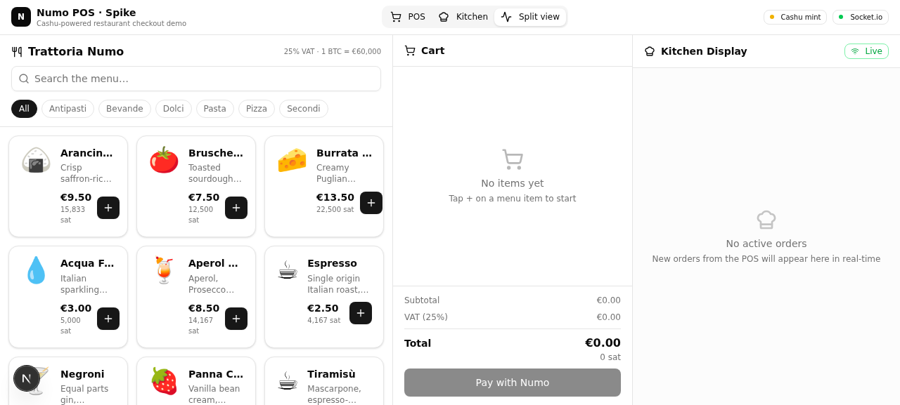

# Numo POS · Spike

A hackathon spike that turns [**Numo**](https://github.com/cashubtc/numo) — the open-source Cashu payment terminal — into a restaurant checkout flow. A web shop loads a menu, builds a cart, triggers a Cashu payment via a mock mint, emits the **real Numo v2 `payment.received` webhook**, and submits the order to a real-time kitchen endpoint so the kitchen can start cooking.



---

## Why this exists

Numo is a **native Android POS app** that speaks Cashu (ecash over NFC / Nostr) and Lightning. It has **no inbound API** — it can't be told "request 1 500 sats from this customer". The only externally observable surface is the **outbound `payment.received` webhook** (v2 schema, documented at [`docs/NUMO_RESEARCH.md`](docs/NUMO_RESEARCH.md)).

That makes a Numo integration a **backend integration problem**: you build a webhook receiver that turns a Numo payment confirmation into a real-world action. For a restaurant, that action is *"create a kitchen ticket and tell the kitchen to start cooking"*.

This spike demonstrates exactly that loop, end-to-end, with a mock Cashu mint standing in for the real Numo terminal so the whole thing runs in a browser.

```
┌─────────────────────┐     ┌─────────────────────┐     ┌──────────────────────┐
│ POS browser         │     │ Next.js backend     │     │ Kitchen browser      │
│                     │     │                     │     │                      │
│ browse menu         │────▶│ /api/restaurant/menu│     │                      │
│ add to cart         │     │                     │     │                      │
│ click "Pay w/ Numo" │────▶│ /api/mint/quote     │     │                      │
│ simulate wallet pay │────▶│ /api/mint/pay       │     │                      │
│ (auto)              │────▶│ /api/mint/verify    │     │                      │
│ (auto)              │────▶│ /api/webhooks/numo  │────▶│ POST /broadcast      │
│                     │     │  ↳ persist order    │     │ ↘ Socket.io          │
│                     │     │  ↳ emit webhook fmt │     │                      │
│                     │     │                     │◀───│ PATCH /api/kitchen/…  │
│                     │     │                     │     │  (advance status)    │
└─────────────────────┘     └─────────────────────┘     └──────────────────────┘
                                       │
                                       ▼
                            ┌─────────────────────┐
                            │ Mock Cashu mint      │
                            │ (in-memory)          │
                            │ NUT-04/05/17-style   │
                            └─────────────────────┘
```

The webhook handler accepts **either** the full Numo v2 payload (production contract) **or** a simplified POS shape that the handler normalises via `buildNumoPaymentReceivedWebhook()`. That means a **real Numo terminal could POST to `/api/webhooks/numo` unchanged** — only the mock mint and the simulated "I paid" step would need to be replaced.

---

## What's inside

| Path | What it is |
|---|---|
| `src/app/api/restaurant/menu/route.ts` | Legacy restaurant API — products & prices (Prisma/SQLite) |
| `src/app/api/mint/quote/route.ts` | Mock NUT-04 mint quote — returns a BOLT11 invoice |
| `src/app/api/mint/pay/route.ts` | Simulate customer paying the invoice — mints Cashu proofs |
| `src/app/api/mint/verify/route.ts` | Verify Cashu proofs (NUT-07-style) — marks spent |
| `src/app/api/webhooks/numo/route.ts` | **Numo v2 `payment.received` receiver** — persists order + broadcasts to kitchen |
| `src/app/api/kitchen/orders/route.ts` | Kitchen endpoint — list active orders |
| `src/app/api/kitchen/orders/[id]/route.ts` | Kitchen endpoint — advance order status |
| `src/lib/numo-webhook.ts` | Verbatim Numo v2 schema + payload builder |
| `src/lib/mock-mint.ts` | In-memory Cashu mint (quote → proofs → verify) |
| `src/lib/kitchen-events.ts` | Helper that POSTs to the Socket.io mini-service |
| `src/lib/cart-store.ts` | Zustand cart store (with `useShallow` to dodge React 19 infinite loops) |
| `mini-services/kitchen-service/` | Socket.io mini-service on port 3003 |
| `prisma/schema.prisma` | MenuItem + Order + OrderItem tables |
| `scripts/seed-menu.ts` | Seeds the demo Italian restaurant menu |
| `scripts/clear-orders.ts` | Wipes test orders |
| `docs/NUMO_RESEARCH.md` | Full research report on the cashubtc/numo project |

---

## Tech stack

- **Next.js 16** (App Router, Turbopack) + **TypeScript 5**
- **Prisma** ORM + **SQLite**
- **Tailwind CSS 4** + **shadcn/ui** (New York style)
- **Zustand** for cart state (with `persist` middleware — survives refresh)
- **Socket.io** for real-time kitchen updates (mini-service on port 3003)
- **`qrcode.react`** for the BOLT11 invoice QR code
- **Bun** as the package manager + runtime

---

## Quick start

### Prerequisites

- [Bun](https://bun.sh/) ≥ 1.0
- That's it. No Docker required for the spike — the mock mint is in-memory.

### 1. Install dependencies

```bash
bun install
cd mini-services/kitchen-service && bun install && cd ..
```

### 2. Configure environment

```bash
cp .env.example .env
```

Defaults are fine for local dev. See `.env` for what each variable does.

### 3. Set up the database

```bash
bun run db:push      # create the SQLite schema
bun run db:seed      # seed the demo menu (Trattoria Numo, 17 dishes)
```

### 4. Start the services

You need **two processes** running side-by-side:

```bash
# Terminal 1 — Next.js app
bun run dev

# Terminal 2 — Socket.io mini-service for real-time kitchen updates
bun run kitchen-service
```

Then open **http://localhost:3000** in your browser.

> 💡 The dev server auto-runs in some sandbox environments — check `dev.log` to see if it's already up.

### 5. (Optional) Run behind Caddy for production-style routing

The repo ships a `Caddyfile` that routes `?XTransformPort=3003` queries to the kitchen-service, so the frontend can talk Socket.io through a single origin. This is what the gateway sandbox uses. For local hackathon demos you don't need it — Next.js and the kitchen-service run on different ports and the browser is fine with that.

---

## Using the demo

1. The default view is **Split** — POS on the left, kitchen on the right.
2. Tap **+** on any menu item to add it to the cart. Adjust quantities with **−** / **+**.
3. Click **Pay with Numo** to open the payment modal.
4. The modal fetches a NUT-04 mint quote and shows a **QR code** with the BOLT11 invoice.
5. Click **Simulate customer payment** — this stands in for the customer paying the invoice with their Lightning wallet. The mock mint then issues Cashu proofs.
6. Proofs are verified at the mint, then the POS emits a **Numo v2 `payment.received` webhook** to its own backend.
7. The webhook handler persists the order and broadcasts a `kitchen:order:new` Socket.io event — the kitchen display updates in real-time.
8. On the kitchen side, click **Start cooking** → **Mark ready** → **Pick up** to advance the order through its lifecycle.

---

## API reference

### `GET /api/restaurant/menu`
Returns the full menu grouped by category, plus restaurant metadata (VAT rate, BTC price).

### `POST /api/mint/quote`
Body: `{ "amountSats": 1500 }`
Returns: `{ quote, request, amountSats, unit, state, expiry, mintUrl }`

### `POST /api/mint/pay`
Body: `{ "quote": "q_..." }`
Returns: `{ quote, state, paidAt, proofs: [...], token: "cashuA..." }`

### `POST /api/mint/verify`
Body: `{ "proofs": [...] }`
Returns: `{ ok, totalSats, spent: [...] }`

### `POST /api/webhooks/numo`
Accepts **either** the full Numo v2 payload **or** the simplified POS shape:
```json
{
  "event": "payment.received",
  "payloadVersion": 2,
  "paymentId": "q_...",
  "amountSats": 47917,
  "basketId": "pos_...",
  "lineItems": [
    { "itemId": "arancini", "name": "Arancini (3 pc)",
      "category": "Antipasti", "quantity": 1,
      "netPriceCents": 950, "priceSats": 15833 }
  ]
}
```
Returns: `{ ok, orderId, eventId }`

If `NUMO_WEBHOOK_AUTH_KEY` is set, requests must include `Authorization: Bearer <key>` (Numo is permissive about the prefix).

### `GET /api/kitchen/orders`
Returns: `{ orders: [...] }` — active orders, newest first.

### `PATCH /api/kitchen/orders/[id]`
Body: `{ "status": "PREPARING" }` — one of `NEW | PREPARING | READY | PICKED_UP`.
Returns: `{ ok, id, status }` — and broadcasts `kitchen:order:update` over Socket.io.

---

## Numo v2 webhook contract

The handler at `src/app/api/webhooks/numo/route.ts` honours the exact schema documented at [`docs/NUMO_RESEARCH.md`](docs/NUMO_RESEARCH.md) — verbatim TypeScript types are in [`src/lib/numo-webhook.ts`](src/lib/numo-webhook.ts).

Key facts from the research:

- **`token` is never included** — only metadata (amount, mint, status, line items).
- **Auth is per-endpoint**, configured inside Numo (Settings → Webhooks). When set, Numo sends `Authorization: <configured-auth-key>` — sometimes with `Bearer ` prefix, sometimes without. The handler is permissive about that.
- **`checkout`** is present only for checkout-originated payments (i.e. when the merchant built a basket in Numo before requesting payment).
- **Nullable fields** are often omitted from JSON in Android — the TypeScript types treat them as `optional`.

---

## Roadmap from spike to production

This is a **spike** — a fast end-to-end proof of concept. To make it production-ready:

1. **Replace the mock mint** with `@cashu/cashu-ts` talking to a real Cashu mint. The Numo repo ships a regtest `docker-compose.yml` (BTCPay + CDK mint + LND + bitcoind) you can use locally.
2. **Replace the simulated "I paid" click** with a real wallet — either a Cashu browser extension, a wallet like Nutstash, or Numo itself on Android.
3. **Wire a real Numo terminal** — install the APK, point Settings → Webhooks at your deployed `/api/webhooks/numo`, set `NUMO_WEBHOOK_AUTH_KEY`.
4. **Add order correlation** — Numo has no foreign order-id concept, so correlating a Numo payment with a web-shop order requires matching on amount + basket contents. The spike sidesteps this by having the POS emit the webhook itself; in production you'd need either (a) the merchant to type the exact same amount into Numo, or (b) Numo's basket CSV import to mirror what the POS built.
5. **Add idempotency** — the webhook handler should dedupe on `eventId` so retries don't create duplicate orders. (Numo retries 3× with 0/1s/2.5s delays.)
6. **Persist spent proofs** — the mock mint's spent-proof set is in-memory; a real integration persists these in the database.

---

## Acknowledgments

- [**cashubtc/numo**](https://github.com/cashubtc/numo) — the original Android POS this spike integrates with. The webhook contract, mint URLs, and integration patterns all come from reading their source.
- [**Cashu**](https://github.com/cashubtc/cashu) — the ecash protocol this is all built on.
- [**Trattoria Numo**](docs/screenshots/01-split-view.png) — fictional restaurant, real recipes (the menu items are legit Italian classics).

---

## License

MIT — do whatever you want with this. It's a hackathon spike, not production code. Review the mock-mint and webhook code carefully before putting any sats on the line.
